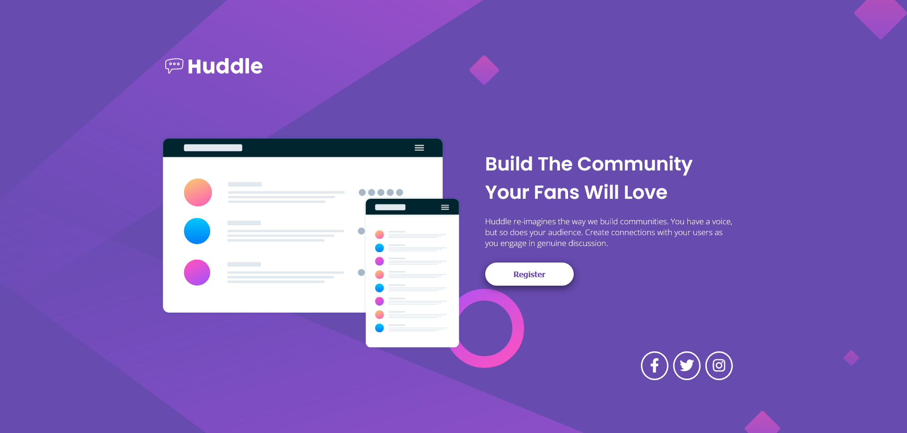
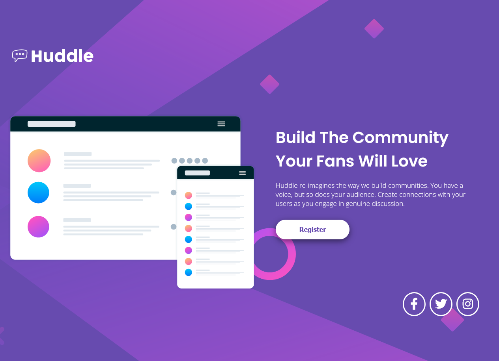

# Frontend Mentor Solution - Website Huddle

First landing page project of the website done by myself from start to finish! It’s a solution for Frontend Mentor to practice HTML and CSS concepts. Although I had difficulties with some concepts, I am proud that I did it!

## Overview

### The challenge

- Build out the project to the designs provided

### Screenshot

### 🖇️ Links

- Live Site URL: [https://trincode.github.io/site-huddle-one-page](https://trincode.github.io/site-huddle-one-page/)
- Solution URL: [https://github.com/trincode/site-huddle-one-page](https://github.com/trincode/site-huddle-one-page)

## My process

### 💻 Built with

- HTML5
- CSS3
- CSS Flexbox

### ⚒️ Challenges and Concepts Applied

- Responsive Design
- CSS Flexbox

### ⏲️ Aproximated Time

- 1 day

## Author

- LinkedIn - [Clayton Trindade](https://www.linkedin.com/in/clayton-trindade-93b925329/)
- Frontend Mentor - [@trincode](https://www.frontendmentor.io/profile/trincode)
